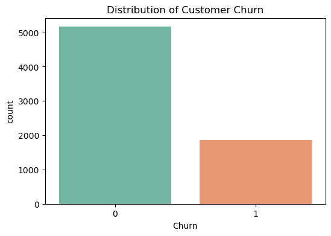
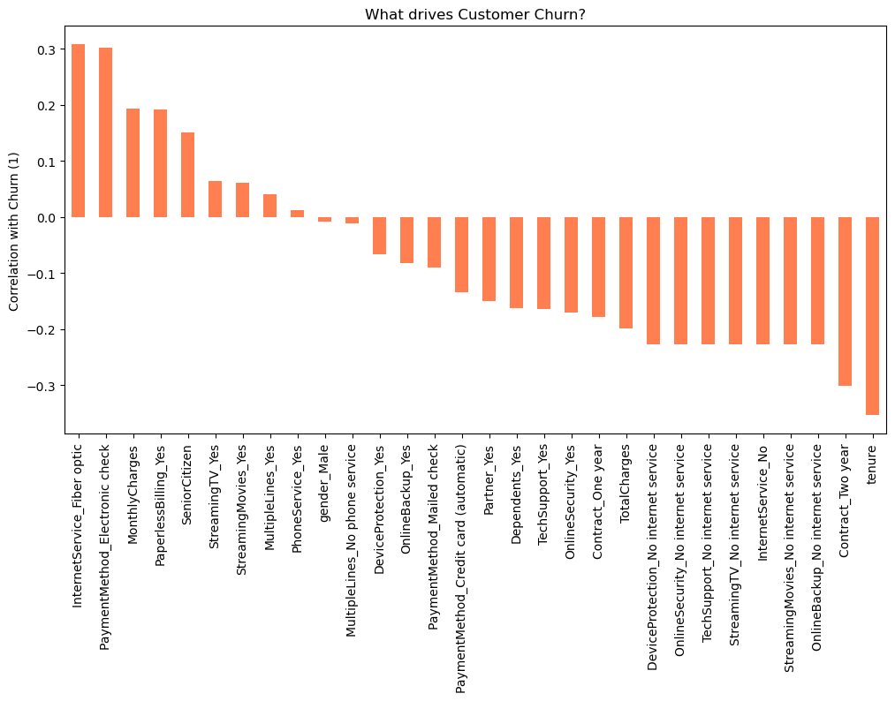
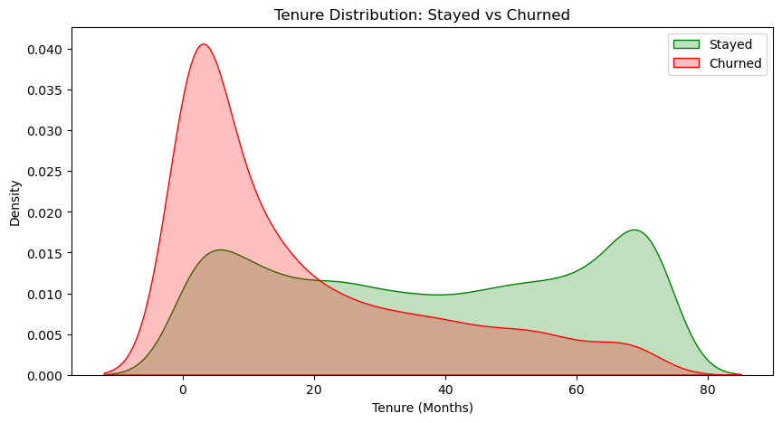

<div align="center">

# 📊 Customer Churn Prediction

An end-to-end Machine Learning project to predict customer churn based on historical data. By identifying customers at risk of leaving, businesses can proactively offer targeted retention strategies and improve overall customer satisfaction.

<p align="center">
  
  
  
  
</p>

</div>

---

## 🎯 Project Overview

Customer churn is a critical metric for subscription-based businesses. This project analyzes customer demographics, account information, and service usage to build a robust predictive model that estimates the probability of a customer churning.

### 🔑 Key Objectives
*   **Exploratory Data Analysis (EDA):** Uncover patterns and relationships in customer behavior.
*   **Data Preprocessing:** Handle missing values, encode categorical features, and scale numerical data.
*   **Model Building:** Train and evaluate various machine learning models to find the best performer.
*   **Insights Generation:** Identify key features driving customer churn.

---

## 📈 Visual Insights

This project relies on comprehensive data visualization to understand the underlying patterns. Below are key visual insights extracted during the analysis phase.

<div align="center">
  <h3>1. Distribution of Customer Churn</h3>
  
  <p><em>Shows the baseline class imbalance by comparing the number of churned vs. retained customers.</em></p>
</div>

<br>

<div align="center">
  <h3>2. What drives Customer Churn? (Feature Correlation)</h3>
  
  <p><em>Displays the linear relationship between numerical features and the target variable, highlighting which features most strongly impact churn.</em></p>
</div>

<br>

<div align="center">
  <h3>3. Tenure Distribution: Stayed vs Churned</h3>
  
  <p><em>A density plot that visualizes how customer tenure differs between those who stayed and those who churned.</em></p>
</div>

---

## 📂 Project Structure

```text
Customer Churn Prediction/
├── data/               # Raw and processed datasets
├── images/             # Visualizations and plots (Add your images here)
├── notebook/           # Jupyter notebooks for EDA and Modeling
│   ├── 01_Full_ML_Pipeline.ipynb
│   ├── churn_model.pkl # Trained ML model
│   ├── scaler.pkl      # Data scaler for preprocessing
│   └── expected_columns.pkl
├── README.md           # Project documentation
└── requirements.txt    # Python dependencies
```

---

## 🚀 Getting Started

### Prerequisites

Ensure you have Python installed. You can install the required dependencies using `pip`:

```bash
pip install -r requirements.txt
```

### Usage

1.  Navigate to the `notebook/` directory.
2.  Open `01_Full_ML_Pipeline.ipynb` in Jupyter Notebook or JupyterLab:
    ```bash
    jupyter notebook 01_Full_ML_Pipeline.ipynb
    ```
3.  Run the cells sequentially to see the data processing, visualization, model training, and evaluation steps.

---

## 🔮 Future Scope
*   **API Deployment:** Deploy the model as a REST API using Flask or FastAPI.
*   **Interactive Dashboard:** Create a user-friendly frontend dashboard (e.g., using Streamlit) for business stakeholders to input customer data and get real-time churn predictions.
